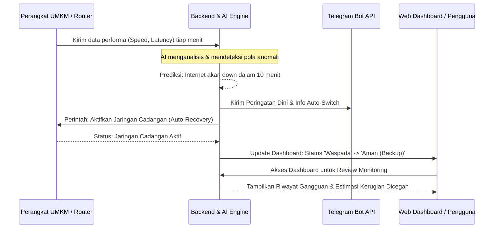
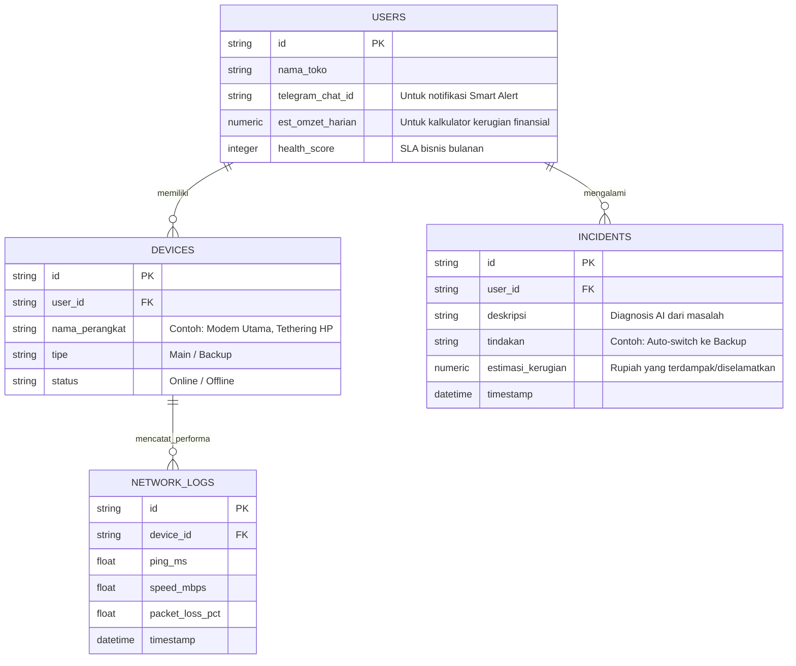

# PRD — Project Requirements Document

## 1. Overview
Berdasarkan observasi, gangguan internet selama 30–60 menit pada UMKM yang bergantung pada transaksi digital dapat menyebabkan kehilangan transaksi harian, penurunan kepercayaan pelanggan, dan gangguan operasional pembayaran non-tunai. UMKM modern (seperti penjual *fashion*, makanan, *live seller*, atau ritel *phigital*) sangat bergantung pada koneksi internet yang stabil untuk menerima pesanan, memproses transaksi QRIS, mengelola operasional *marketplace*, dan menjalankan *livestream*. Saat internet bermasalah, pemilik usaha sering kali hanya bisa merestart modem secara manual, menghubungi *customer service* yang lambat, atau pasrah menunggu jaringan pulih tanpa memahami penyebabnya. Hal ini membuang waktu operasional dan yang paling fatal: **menyebabkan kerugian finansial langsung**.

**Asumsi Dasar:**
*   1 jam downtime saat *live seller* → potensi kehilangan 10–20 transaksi langsung.
*   Transaksi QRIS gagal saat *checkout* → buyer batal membeli & kehilangan minat.
*   *Marketplace* offline/lambat → penurunan *rating* toko, penurunan konversi, & penalti algoritma platform.

**Autonomous Business Connectivity Guardian** hadir sebagai solusi. Aplikasi ini bukan sekadar *dashboard* pemantau jaringan, melainkan AI yang bekerja 24/7 untuk menjaga konektivitas bisnis. AI ini mampu memprediksi gangguan sebelum terjadi, memindahkan jalur internet secara otomatis ke jaringan cadangan, dan menghitung estimasi kerugian finansial akibat gangguan tersebut. Pemilik UMKM tidak perlu memiliki keahlian teknis sama sekali; AI yang akan menganalisis kondisi jaringan, mengambil keputusan berbasis aturan, dan menjalankan tindakan pemulihan otomatis agar bisnis tetap *online*.

## 2. Requirements
*   **Fokus Bisnis, Bukan Teknis:** Bahasa yang digunakan di dalam aplikasi harus sederhana dan berorientasi pada bisnis (contoh: bukan "Packet loss 50%", melainkan "Koneksi tidak stabil, berisiko mengganggu Livestream").
*   **Otomatisasi Penuh (Zero-Touch):** Sistem harus bisa mengambil tindakan otomatis (seperti mengganti jaringan) tanpa menunggu persetujuan manual pengguna saat kondisi kritis.
*   **Peringatan Dini (Proaktif):** Sistem harus memberi tahu pengguna *sebelum* internet benar-benar mati total berdasarkan pola penurunan performa.
*   **Aksesibilitas Tinggi:** Peringatan dan ringkasan masalah harus dikirimkan ke platform notifikasi yang mudah dipantau UMKM, yaitu Telegram.
*   **Keamanan & Privasi:** Data jumlah transaksi (untuk perhitungan kerugian) dan manajemen perangkat harus dijaga privasinya.

## 3. Core Features (MVP)
1.  **Predictive Alert (Peringatan Dini):** AI secara terus-menerus memantau latensi, kecepatan, dan *packet loss*. Jika menemukan pola anomali yang menunjukkan koneksi akan terputus, sistem akan memberi notifikasi dini kepada pengguna agar bisa bersiap atau tetap fokus berjualan.
2.  **Auto Recovery (Ganti Jaringan Otomatis):** Jika koneksi utama mencapai ambang batas kritis, AI akan otomatis memerintahkan *gateway* lokal untuk beralih ke jalur cadangan (modem *backup* / *tethering* HP) tanpa intervensi manusia, memastikan operasional tidak berhenti.
3.  **Telegram Notification (Notifikasi Real-Time):** Semua alert, status pergantian jaringan, dan ringkasan kejadian akan dikirim langsung ke Telegram pemilik UMKM. Pesan disusun dalam bahasa sehari-hari yang jelas, bukan istilah teknis jaringan.
4.  **Business Impact Estimator (Kalkulator Kerugian Bisnis):** Mengubah durasi gangguan menjadi nominal uang. Sistem menghitung estimasi pendapatan yang hilang atau berhasil diselamatkan berdasarkan estimasi omzet harian atau kategori skala usaha yang diinput pengguna, memberikan gambaran konkret atas dampak jaringan terhadap omzet.

## 4. User Flow
Berikut adalah perjalanan sederhana pengguna, dari pendaftaran hingga saat terjadi potensi masalah jaringan:

1.  **Setup & Onboarding:** Pengguna mendaftar dan menghubungkan aplikasi dengan *router* toko. Pengguna cukup memasukkan estimasi omzet harian atau memilih kategori skala usahanya. Sistem kemudian mengonversi data tersebut secara otomatis menjadi estimasi potensi kerugian finansial berdasarkan durasi gangguan jaringan.
2.  **Monitoring Pasif:** AI bekerja di latar belakang (24/7). Pengguna bebas melakukan aktivitas bisnis seperti *livestream* atau melayani pembeli di toko tanpa membuka aplikasi.
3.  **Pendeteksian (Predictive Stage):** AI mendeteksi koneksi mulai melambat secara tidak wajar.
4.  **Tindakan Otomatis & Notifikasi:**
    *   AI secara otomatis memindahkan *routing* internet ke modem cadangan.
    *   AI mengirim pesan Telegram: *"Halo, koneksi utama melambat. Untuk mencegah gangguan Livestream, AI telah memindahkan koneksi ke jaringan cadangan. Potensi kerugian Rp500.000 berhasil dicegah."*
5.  **Review Monitoring:** Pengguna membuka aplikasi untuk melihat riwayat gangguan, status recovery, dan estimasi kerugian yang berhasil dicegah.

## 5. Architecture
Sistem terdiri dari agen pemantau lokal (berjalan di perangkat toko/router) yang terus mengirim data ke *Cloud* AI. AI di *Cloud* menganalisis pola, memicu tindakan *auto-switch* kembali ke agen lokal, dan mengirim notifikasi.

### AI Detection Engine
Mesin deteksi AI bekerja berdasarkan lapisan logika terstruktur untuk menyeimbangkan kecepatan respons dan akurasi:

*   **Rule-based Anomaly Detection:** Menggunakan aturan tetap untuk mendeteksi penyimpangan mendadak dari baseline jaringan normal.
*   **Moving Average Latency Analysis:** Menghitung rata-rata pergerakan latensi dalam jendela waktu 3-5 menit untuk menghindari *false positive* akibat fluktuasi sesaat.
*   **Threshold Prediction:** Menetapkan ambang batas keselamatan yang memicu level respons berbeda.
*   **Historical Pattern Learning:** Mencatat pola gangguan sebelumnya (waktu sibuk, hari tertentu, atau setelah hujan) untuk menyesuaikan sensitivitas deteksi secara dinamis.

**Logika Ambang Batas (Threshold Logic):**
*   **Level Waspada:** 
    Jika `latency > 150ms` (durasi ≥ 3 menit) DAN `packet loss > 10%`
    → Status sistem berubah menjadi `WASPADA`. Sistem mengirimkan Prediksi Dini via Telegram & menyiapkan jalur cadangan.
*   **Level Kritis:** 
    Jika `latency > 250ms` ATAU `packet loss > 20%` ATAU koneksi putus total
    → Status sistem berubah menjadi `KRITIS`. Sistem langsung memicu `Auto-Recovery` (pergantian jaringan otomatis) & mengirimkan laporan status recovery.

## 6. Database Schema
Berikut adalah desain struktur data utama yang dibutuhkan untuk menjalankan aplikasi.

**Daftar Tabel Terpenting:**
*   **users:** Menyimpan profil pemilik UMKM, nomor kontak, dan pengaturan bisnis.
*   **devices:** Menyimpan daftar *router* atau koneksi jaringan (Utama & Cadangan) milik pengguna.
*   **network_logs:** Menyimpan rekaman riwayat kualitas internet (untuk dianalisis oleh AI dalam memprediksi *downtime*).
*   **incidents:** Mencatat setiap kejadian gangguan, tindakan otomatis yang diambil AI, beserta estimasi kerugian nominal.

## 7. Tech Stack
Mengingat aplikasi ini membutuhkan *dashboard* visual yang menarik, pengolahan AI, serta performa pengiriman data yang cepat, berikut adalah rekomendasi teknologinya:

*   **Frontend web / Dashboard:** **Next.js** (React framework unggulan dengan performa tinggi) dikombinasikan dengan **Tailwind CSS** & komponen siap pakai **shadcn/ui** agar tampilan terlihat profesional, modern, dan informatif.
*   **Backend / API:** Menyatukan logika di dalam **Next.js (API Routes)** agar *development* lebih cepat dan efisien.
*   **Database:** **SQLite** digunakan untuk efisiensi pengembangan prototype dan kemudahan deployment lokal. Pada implementasi produksi, arsitektur dapat ditingkatkan ke **PostgreSQL** untuk mendukung skalabilitas multi-tenant.
*   **Authentication:** **Better Auth** untuk login pengguna yang aman dan simpel.
*   **AI Engine (Fitur Prediksi & Logika Deteksi):** Logika *threshold* & analisis pola dijalankan via **Node.js/Python backend services**, dengan integrasi **OpenAI API** untuk merangkum data teknis menjadi penjelasan bahasa manusia pada notifikasi.
*   **Notification Integration:** **Telegram Bot API** untuk mengirim otomatisasi pesan peringatan dan status *recovery* langsung ke akun pengguna.
*   **Local Agent (Simulasi Auto-Switch):** *Script* ringan (misal: Python/Node.js) yang bisa dijalankan di PC toko atau mikrotik sederhana untuk simulasi fungsi pergantian koneksi. *(Catatan eksekusi teknis untuk developer)*.

## 8. Screen Structure
Aplikasi web dashboard dirancang minimalis dengan fokus pada informasi bisnis, bukan konfigurasi teknis.

1.  **Dashboard Utama:** Menampilkan skor kesehatan jaringan (Health Score), status koneksi aktif (Utama/Cadangan), estimasi pendapatan yang "diselamatkan" hari ini, serta notifikasi status terbaru.
2.  **Riwayat Gangguan:** Daftar kronologis setiap kejadian jaringan. Setiap entri menampilkan waktu, durasi, penyebab (diagnosis AI), tindakan yang diambil, dan nominal dampak keuangan.
3.  **Pengaturan Sistem:** Halaman untuk mengelola profil toko, memasukkan estimasi omzet harian atau memilih kategori skala usaha, mengatur Telegram penerima notifikasi, serta konfigurasi jalur jaringan utama & cadangan.

## 9. Success Metrics
Target kinerja sistem yang akan digunakan untuk mengukur keberhasilan MVP:
*   **Deteksi gangguan minimal 3 menit sebelum downtime total**
*   **Keberhasilan auto-switch ≥ 90%**
*   **Pengurangan downtime bisnis ≥ 70%**
*   **Waktu recovery < 30 detik**
*   **Akurasi estimasi gangguan ≥ 85%** (dibandingkan dengan riil transaksi harian)

## 10. Competitive Advantage
Mengapa *AI Agent Business Guardian* berbeda dibandingkan *monitoring tools* biasa:

| Aspek | Conventional Monitoring Tools | AI Agent Business Guardian |
|-------|-----------------------------|----------------------------|
| **Respons Gangguan** | Hanya memberi tahu saat internet sudah mati / *down*. | Memprediksi gangguan sebelum mati berdasarkan anomali latensi & *packet loss*. |
| **Tindakan** | Membiarkan pengguna memperbaiki secara manual (karena tidak bisa otomatis). | Bertindak otomatis (*zero-touch*) dengan mengalihkan jalur internet ke *backup*. |
| **Dampak Keuangan** | Tidak menghitung atau memberi konteks omzet yang hilang. | Menghitung dampak bisnis secara real-time (nominal Rupiah yang hilang/diselamatkan). |
| **Komunikasi** | Mengirim alert teknis rumit (`Error 503, Latency Spike`). | Menjelaskan masalah dalam bahasa non-teknis & berorientasi bisnis langsung ke Telegram. |

## 11. Prototype Scope & Limitation
Ruang lingkup pengembangan saat ini difokuskan pada validasi inti sistem:

**Prototype ini mensimulasikan:**
*   Monitoring koneksi secara berkala (latensi, kecepatan, *packet loss*).
*   Prediksi gangguan berbasis *threshold* & analisis pola dasar.
*   Notifikasi otomatis via Telegram dengan bahasa bisnis.
*   Simulasi *auto-switch* jaringan (dikerjakan via *script* lokal & perintah API ke *gateway* simulasi).

**Belum mencakup:**
*   Integrasi router komersial real production (seperti Mikrotik Enterprise, Cisco, atau ISP modem secara native).
*   Deployment operator-level atau skala infrastruktur masif.
*   *Machine learning training* skala besar & model prediktif yang membutuhkan jutaan sampel data historis (akan dikembangkan pada fase v2).
*   **Integrasi dengan API payment gateway atau POS digital untuk penghitungan kerugian real-time berdasarkan transaksi aktual (akan dikembangkan pada fase lanjutan).**

Pada tahap prototype, validasi fitur auto-recovery dilakukan melalui skenario simulasi menggunakan dua sumber koneksi internet (utama dan cadangan). Pergantian jaringan dieksekusi melalui script lokal yang mengatur prioritas koneksi pada perangkat gateway simulasi untuk merepresentasikan mekanisme failover otomatis pada lingkungan UMKM.
